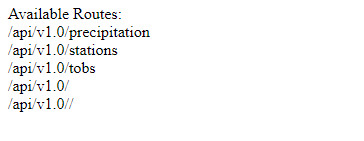

# sqlalchemy-challenge

- Designed a Flask API based on the queries developed in climate_starter.ipynb file
    - Home page (/)
        -Displaying all of the available routes
        
    
    - Precipitation page (/api/v1.0/precipitation)
        - Displaying the last 12 months of precipitation data
        