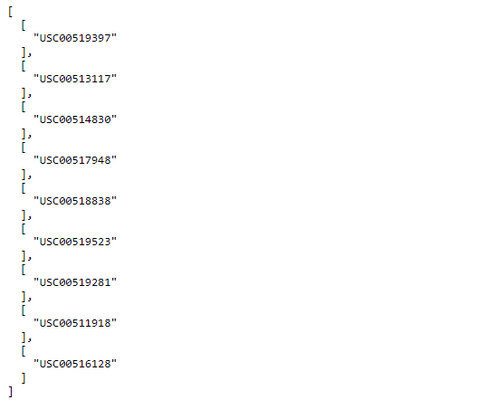
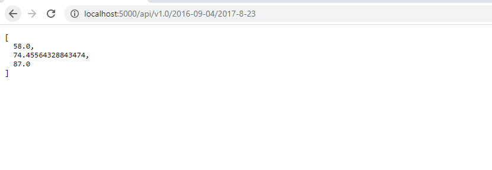

# Hawaii-Climate-Analysis-App

- Designed a Flask API based on the queries developed in climate_starter.ipynb file
    - Home Page (/)
        - Displaying all of the available routes
        
    
    - Precipitation Page (/api/v1.0/precipitation)
        - Displaying the last 12 months of precipitation data
        

    - Sations Page (/api/v1.0/stations)
        - Displaying a JSON list of stations from the dataset
        

    - Temperature Observations Page (/api/v1.0/tobs)
        - Displaying the dates and temperature observations of the most active station for the last year of data
        

    - Calculation Page (/api/v1.0/<start>/<end>)
        - Displaying a JSON list of the minimum temperature, the average temperature, and the max temperature for a given start or start-end range
        